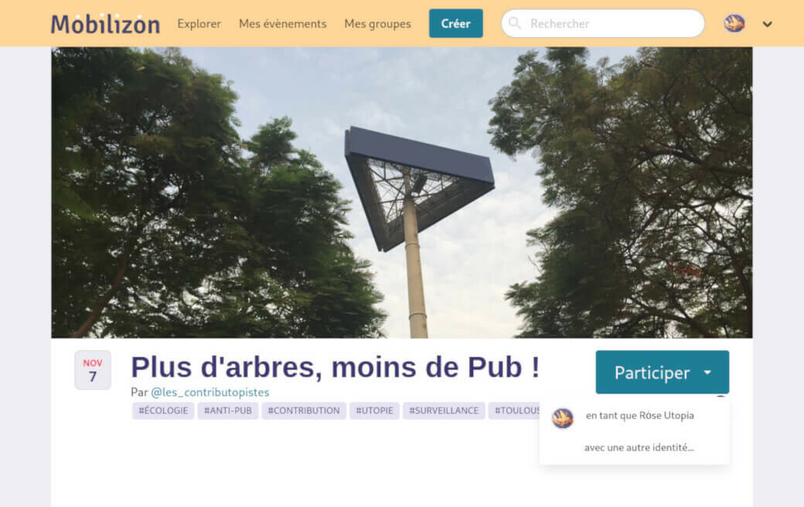

<!--
N.B.: This README was automatically generated by https://github.com/YunoHost/apps/tree/master/tools/README-generator
It shall NOT be edited by hand.
-->

# Mobilizon pour YunoHost

[](https://dash.yunohost.org/appci/app/mobilizon)  

[](https://install-app.yunohost.org/?app=mobilizon)

*[Read this readme in english.](./README.md)*

> *Ce package vous permet d’installer Mobilizon rapidement et simplement sur un serveur YunoHost.
Si vous n’avez pas YunoHost, regardez [ici](https://yunohost.org/#/install) pour savoir comment l’installer et en profiter.*

## Vue d’ensemble

A decentralized and federated platform to organize events

- Mobilizon is a tool that helps you find, create and organize events.

- You can also create a page for your group where the members will be able to get organized together.


**Version incluse :** 3.1.3~ynh1

**Démo :** https://demo.mobilizon.org

## Captures d’écran



## Avertissements / informations importantes

* **Mobilizon** require a dedicated **root domain**, eg. mobilizon.domain.tld
* To connect as **Mobilizon** administrator, use the email address and password of the user you choose during install
* By default registrations are closed
* All YunoHost users are allowed to connect

* Configuration can be made in the Mobilizon administration panel.

## Documentations et ressources

* Site officiel de l’app : <https://joinmobilizon.org/>
* Documentation officielle utilisateur : <https://docs.joinmobilizon.org>
* Dépôt de code officiel de l’app : <https://framagit.org/framasoft/mobilizon/>
* Documentation YunoHost pour cette app : <https://yunohost.org/app_mobilizon>
* Signaler un bug : <https://github.com/YunoHost-Apps/mobilizon_ynh/issues>

## Informations pour les développeurs

Merci de faire vos pull request sur la [branche testing](https://github.com/YunoHost-Apps/mobilizon_ynh/tree/testing).

Pour essayer la branche testing, procédez comme suit.

``` bash
sudo yunohost app install https://github.com/YunoHost-Apps/mobilizon_ynh/tree/testing --debug
ou
sudo yunohost app upgrade mobilizon -u https://github.com/YunoHost-Apps/mobilizon_ynh/tree/testing --debug
```

**Plus d’infos sur le packaging d’applications :** <https://yunohost.org/packaging_apps>